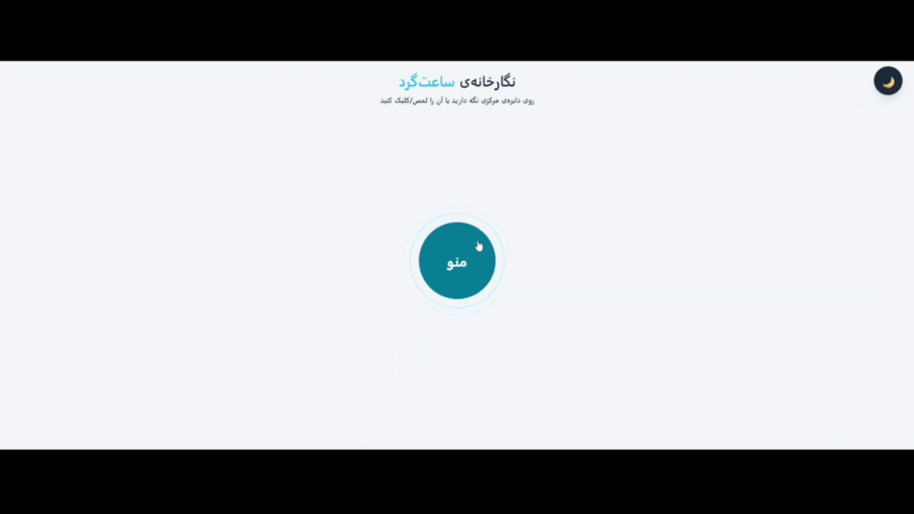
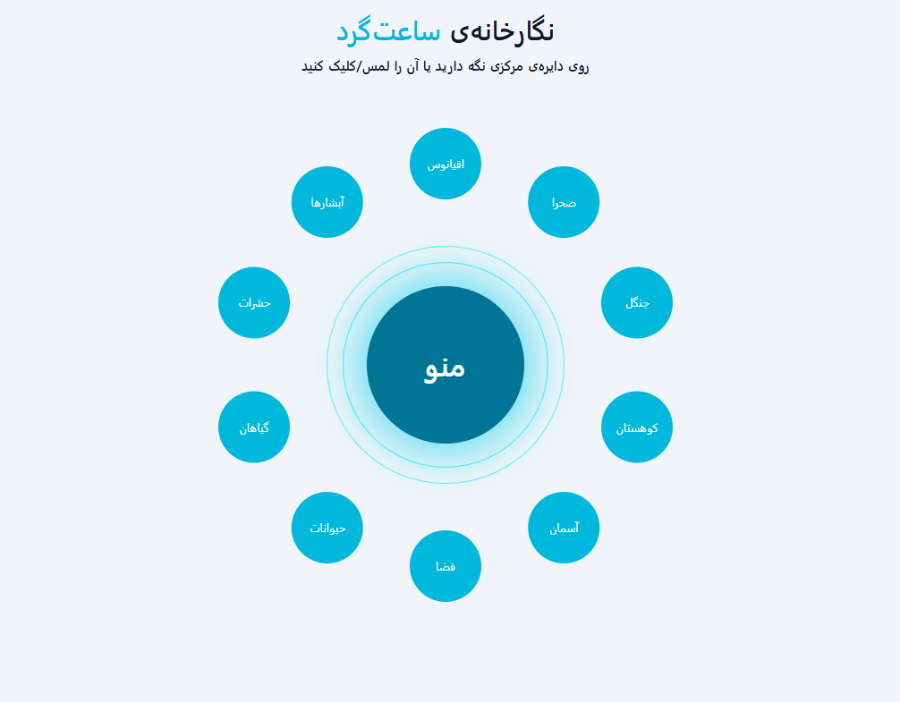
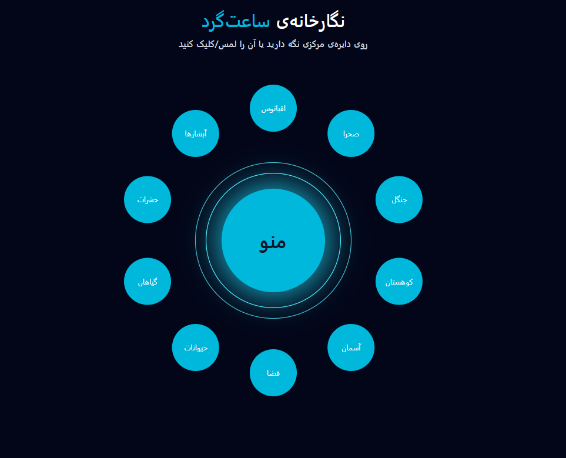

# 🌀 React Circular Gallery

An interactive circular gallery built with **React**, **Vite**, **Tailwind CSS**, and **Framer Motion**.

This project provides a modern radial navigation menu that smoothly expands from the center and displays image or video collections inside a responsive modal.

---

## ✨ Features

- 🎯 Interactive circular navigation
- ⚡ Smooth animations with Framer Motion
- 🖱 Hover & Click interactions
- 🖼 Image Gallery
- 🎥 Video Support
- ↔ Previous / Next navigation
- 📱 Responsive Design
- 🌙 Dark / Light Mode
- 🎨 Modern UI

---

# 📸 Preview

## 🎬 Demo

<p align="center">
  
</p>

## 🖼 Screenshots

<p align="center">
  
  
</p>
---

## 🛠 Built With

- React
- Vite
- Tailwind CSS
- Framer Motion

---

## 📂 Project Structure

```text
src/
│
├── assets/
│
├── components/
│   └── MediaModal.jsx
│
├── data/
│   └── items.js
│
├── pages/
│   └── Home.jsx
│
├── App.jsx
└── main.jsx

public/
│
└── images/
```

---

## 🚀 Installation

Clone the repository

```bash
git clone https://github.com/Mohamdkhz/react-circular-gallery.git
```

Go to project folder

```bash
cd react-circular-gallery
```

Install dependencies

```bash
npm install
```

Run the project

```bash
npm run dev
```

---

## 📱 Responsive

The application is fully responsive and works on:

- Desktop
- Laptop
- Tablet
- Mobile

---

## 🎨 Gallery Categories

- 🌊 Ocean
- 🏜 Desert
- 🌲 Forest
- ⛰ Mountain
- ☁ Sky
- 🌌 Space
- 🐾 Animals
- 🌿 Plants
- 🐞 Insects
- 💧 Waterfalls

---

## 🚀 Future Improvements

- Swipe Gesture
- Fullscreen Mode
- Zoom Image
- Keyboard Navigation
- Search
- Favorites
- Lazy Loading
- Video Thumbnails

---

## 👨‍💻 Author

**Mohammad Khazaei**

GitHub:
https://github.com/Mohamdkhz

---

⭐ If you like this project, consider giving it a star.